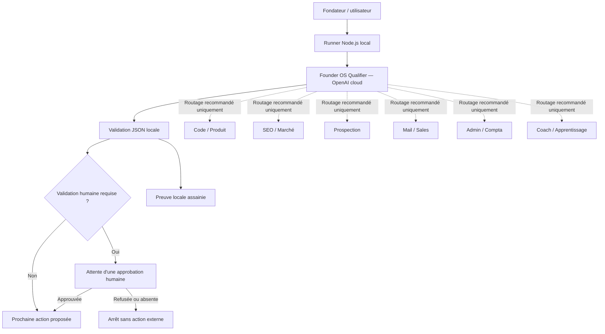

# Architecture de Web Studio OS

## Vue d'ensemble

## Périmètre du premier agent

Founder OS Qualifier est le point d'entrée. Il reformule une demande, recommande
les agents spécialisés, signale les risques, décide si une validation humaine
est nécessaire et propose la prochaine action. Il ne lance pas encore les
agents recommandés et ne possède aucun outil d'action.

Le runner local n'est pas une IA. Il charge les instructions, envoie le contexte
minimal à OpenAI, impose le schéma JSON, rejette une réponse invalide et affiche
une trace assainie avec le coût calculé.

## Contrat et frontières

- **Entrée :** une demande textuelle non fiable et non vide.
- **Traitement cloud :** un unique appel Responses avec `store: false`.
- **Sortie :** un JSON strict validé une seconde fois localement.
- **Erreur :** absence de clé, erreur HTTP, JSON invalide ou contrat incomplet
  provoquent un arrêt explicite ; aucune sortie de remplacement n'est inventée.
- **Actions :** aucune intégration, aucun envoi, aucune écriture distante et
  aucun engagement commercial.

## Flux d'une demande

1. L'utilisateur fournit une demande minimisée et anonymisée.
2. Le runner ajoute uniquement le contexte métier nécessaire.
3. OpenAI produit la qualification contrainte par le schéma.
4. Le runner valide les champs, rôles et invariants, dont l'unicité du risque
   principal.
5. La réponse indique la porte de validation humaine applicable.
6. Le résultat assaini peut être enregistré comme preuve locale.

Les futurs agents spécialistes restent définis dans `docs/agent-roles.md`, mais
leur exécution n'appartient pas à ce premier workflow.
