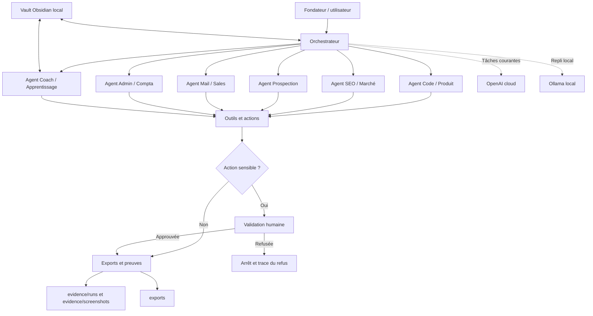

# Architecture de Web Studio OS

## Vue d'ensemble

## Responsabilités des couches

- **Le fondateur** formule la demande, fournit le contexte et approuve les
  actions sensibles.
- **L'orchestrateur** décompose la demande, sélectionne les agents, transmet le
  contexte minimal nécessaire et agrège leurs résultats. Il ne contourne jamais
  la politique de permissions.
- **Les agents spécialisés** produisent des analyses ou des brouillons dans leur
  périmètre métier. Ils n'exécutent pas seuls une action sensible.
- **La couche outils et actions** représente les futures intégrations : fichiers,
  recherche, messagerie, génération documentaire ou API.
- **La porte de validation humaine** bloque toute action classée sensible avant
  son exécution.
- **Les preuves** conservent les traces de runs, décisions, erreurs, validations
  et captures nécessaires pour comprendre le comportement du système.
- **Le vault Obsidian** constitue la mémoire durable locale : décisions, notes
  d'apprentissage et contexte validé.

## Déploiement cloud-first hybride

OpenAI est le fournisseur cloud provisoire pour les tâches courantes qui ne
contiennent pas de donnée sensible non approuvée. Le vault Obsidian, les secrets,
les données personnelles brutes et les documents administratifs restent en
local. Les données sensibles doivent être retirées, anonymisées ou explicitement
autorisées avant un envoi cloud.

Ollama sert de solution locale de repli lorsque la confidentialité, la
disponibilité réseau ou la maîtrise des coûts le justifie. Cette architecture
reste provisoire : les futurs runs devront mesurer la qualité, le coût et les
limites de chaque option.

## Flux d'une demande

1. Le fondateur soumet une demande et les contraintes utiles.
2. L'orchestrateur choisit les agents et limite les données transmises à chacun.
3. Chaque agent produit une sortie traçable en séparant faits, hypothèses et
   inconnues.
4. La politique de permissions détermine si une validation humaine est requise.
5. Le résultat approuvé est exporté et le run est enregistré comme preuve.
6. Une information ne rejoint la mémoire permanente qu'après validation humaine.
