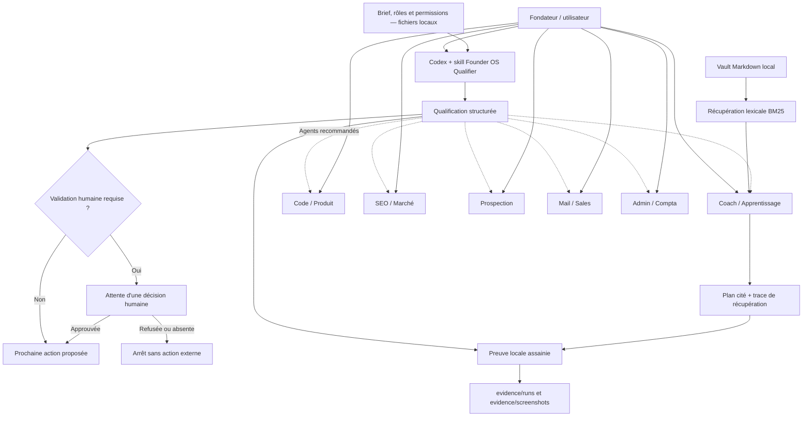

# Architecture de Web Studio OS

## Vue d'ensemble

## Responsabilités

- **Codex** charge la skill, lit le contexte local nécessaire et produit la
  qualification dans la conversation.
- **Founder OS Qualifier** reformule, route, signale les risques, applique la
  politique de validation et propose la prochaine action.
- **Founder OS Coach** exécute le moteur lexical local, lit au plus quatre notes
  classées et produit un plan avec citations et trace de récupération.
- **Les six agents spécialistes** disposent d'une fiche, d'un workflow métier et
  d'une configuration Codex invocable. Le qualifier les recommande mais ne les
  exécute jamais automatiquement.
- **Le dépôt local** conserve la configuration, les preuves et la mémoire.
- **La validation humaine** bloque tout engagement ou action sensible.

## Approche hybride

Le raisonnement est fourni par Codex via la session ChatGPT existante. Aucun
modèle d'IA n'est installé localement et aucune clé API n'est ajoutée. Les
instructions, documents métier, preuves et notes restent dans le projet local.

Les extraits de fichiers lus par Codex entrent toutefois dans son contexte de
traitement. L'approche hybride ne signifie donc pas que les contenus lus restent
hors du service : la minimisation du contexte et la politique de permissions
restent obligatoires.

## Flux d'une demande

1. L'utilisateur invoque `$founder-os-qualifier` avec une demande minimisée.
2. La skill fait lire uniquement le brief, les rôles et les permissions utiles.
3. Codex produit les sept rubriques imposées sans appeler d'outil externe.
4. La sortie sépare faits, hypothèses et inconnues.
5. La décision de validation humaine bloque ou autorise seulement la prochaine
   étape proposée.
6. Une preuve assainie est enregistrée localement lorsque le projet l'exige.

## Flux du Coach

1. L'utilisateur invoque `$founder-os-coach` avec une question.
2. La skill lit les permissions puis exécute le moteur Python local sur `vault/`.
3. Le moteur retourne au plus quatre notes classées par score BM25 lexical.
4. Codex lit uniquement ces notes, distingue leurs statuts et génère la réponse.
5. La sortie conserve le classement, les scores et les chemins cités.
6. Aucune recherche sémantique, écriture de note ou action externe n'est lancée.

## Flux d'un spécialiste

1. L'utilisateur invoque la skill Codex correspondant au métier.
2. L'agent lit son workflow dans `docs/skills/`, sa fiche et les permissions.
3. Il minimise le contexte aux briefs, notes et sources autorisés nécessaires.
4. Il produit le format documenté sans action externe par défaut.
5. Toute étape sensible est bloquée et renvoyée vers une approbation ciblée.
6. Un test assaini peut être conservé dans `evidence/runs/`.
