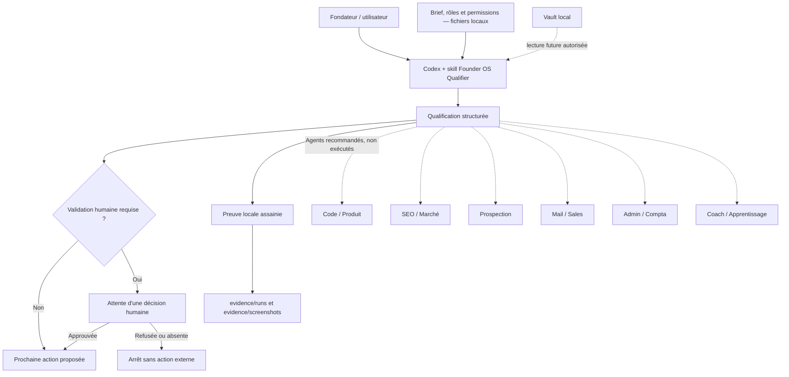

# Architecture de Web Studio OS

## Vue d'ensemble

## Responsabilités

- **Codex** charge la skill, lit le contexte local nécessaire et produit la
  qualification dans la conversation.
- **Founder OS Qualifier** reformule, route, signale les risques, applique la
  politique de validation et propose la prochaine action.
- **Les agents spécialistes** sont seulement recommandés à ce stade ; le
  qualifier ne les exécute pas.
- **Le dépôt local** conserve la configuration, les preuves et la future mémoire.
- **La validation humaine** bloque tout engagement ou action sensible.

## Approche hybride

Le raisonnement est fourni par Codex via la session ChatGPT existante. Aucun
modèle d'IA n'est installé localement et aucune clé API n'est ajoutée. Les
instructions, documents métier, preuves et notes restent dans le projet local.

Les extraits de fichiers lus par Codex entrent toutefois dans son contexte de
traitement. L'approche hybride ne signifie donc pas que les contenus lus restent
hors du service : la minimisation du contexte et la politique de permissions
restent obligatoires.

## Flux d'une demande

1. L'utilisateur invoque `$founder-os-qualifier` avec une demande minimisée.
2. La skill fait lire uniquement le brief, les rôles et les permissions utiles.
3. Codex produit les sept rubriques imposées sans appeler d'outil externe.
4. La sortie sépare faits, hypothèses et inconnues.
5. La décision de validation humaine bloque ou autorise seulement la prochaine
   étape proposée.
6. Une preuve assainie est enregistrée localement lorsque le projet l'exige.
