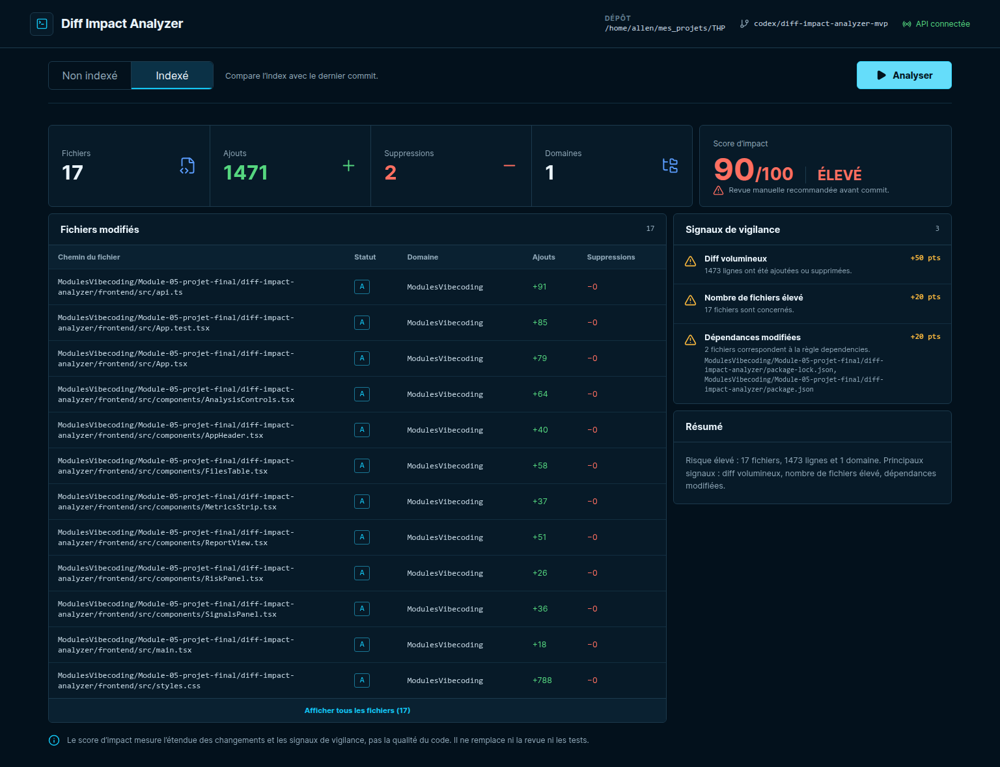

# Diff Impact Analyzer

Diff Impact Analyzer is a local developer tool that inspects unstaged or staged
Git changes and produces an explainable assessment of their scope and risk.

The first MVP pass is functional: it includes a Node.js CLI, a local Express
API, a React dashboard, deterministic scoring, automated tests, and browser QA.



## What It Does

- Analyzes unstaged changes corresponding to `git diff`.
- Analyzes staged changes corresponding to `git diff --cached`.
- Counts changed files and added or deleted lines.
- Groups files by top-level directory and extension.
- Detects documented dependency, infrastructure, security, and database paths.
- Calculates a deterministic score from 0 to 100.
- Returns a Low, Medium, or High verdict with every contributing signal.
- Renders reports as terminal text, Markdown, or a local React dashboard.

The score is an attention indicator. It does not measure code quality, execute
tests, understand business semantics, or prove that a change is safe.

## Requirements

- Node.js 20.19 or newer.
- Git 2.x.
- A local Git repository to inspect.

## Installation

From this project directory:

```bash
npm install
```

## CLI Usage

Analyze unstaged changes in the current repository:

```bash
npm run --silent analyze
```

Analyze staged changes in another repository and render Markdown:

```bash
npm run --silent analyze -- --repo /absolute/path/to/repository --staged --format markdown
```

Available options:

```text
--repo <path>          Repository to inspect; defaults to the current directory
--staged               Analyze the index instead of the working tree
--format text|markdown Output format; defaults to text
--help                 Display CLI help
```

The report is written to stdout. Usage errors return exit code `2`; repository
or Git errors return exit code `1`.

## Local Dashboard

Start the API and bind it to the repository that should be analyzed:

```bash
npm run dev:backend -- --repo /absolute/path/to/repository
```

In another terminal, start Vite:

```bash
npm run dev:frontend
```

Open [http://127.0.0.1:5173](http://127.0.0.1:5173). The API listens only on
`127.0.0.1:3000`, and development CORS is limited to the two documented Vite
origins.

The combined command below starts both services and analyzes the Git repository
containing this project:

```bash
npm run dev
```

## Quality Checks

```bash
npm run lint
npm run typecheck
npm test
npm run build
npm audit
```

Browser QA requires the two development services to be running and Chrome to be
available at `/usr/bin/google-chrome`:

```bash
npm run qa:browser
```

The browser check triggers a staged analysis at desktop and mobile sizes,
rejects console/network errors, checks horizontal overflow, and updates the
screenshots under `docs/screenshots/`.

## Architecture

```text
Git repository
      |
      v
Node Git collector (execFile, no shell)
      |
      v
Metrics, classification, and deterministic scoring
      |                         |
      v                         v
Text/Markdown CLI          Express JSON API
                                |
                                v
                          React dashboard
```

- `backend/`: Git acquisition, analyzer, scoring, CLI, Express API, and tests.
- `frontend/`: React/Vite dashboard, API boundary validation, responsive UI,
  and component tests.
- `shared/contracts.ts`: the public TypeScript contract used by both sides.
- `docs/design/`: generated desktop and mobile design references.
- `docs/screenshots/`: browser-rendered application captures.

The frontend and CLI call the same backend analysis engine. Reports are computed
on demand and are not persisted.

## Risk Model

The score combines changed-line volume, changed-file count, top-level directory
spread, and sensitive path categories. Sensitive-path points are capped at 40,
and the complete score is capped at 100.

Exact thresholds and recognized paths are documented in
[`brief.md`](./brief.md). Every awarded point is included in the report.

## Current Limitations

- Untracked files are excluded, matching the behavior of the selected Git diff.
- Binary files are counted, but their added and deleted lines are unavailable.
- The server analyzes one repository selected at startup.
- The MVP does not compare branches or remote pull requests.
- Reports are not saved or exported directly to files.
- GitHub Actions, Git hooks, configurable rules, and AI integrations are not
  included in this pass.

## Project Documentation

- [`brief.md`](./brief.md): product requirements, contracts, risk rules, and
  acceptance criteria.
- [`brainstorming-project.md`](./brainstorming-project.md): evaluated options and
  product rationale.
- [`journal.md`](./journal.md): AI-assisted development decisions, observed
  failures, corrections, and verification evidence.

## Suggested Second Pass

The next development pass should add CLI end-to-end tests for exit codes and
Markdown snapshots, improve API error middleware, add file-type filtering and
report export, then package the analyzer for use from any repository. GitHub
Action and hook integrations should remain later steps until the core contract
is stable.
